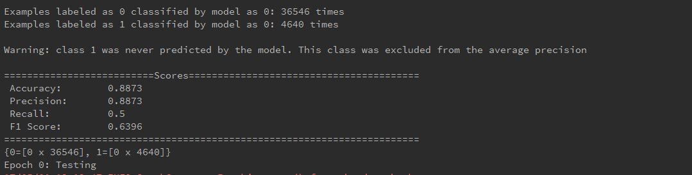
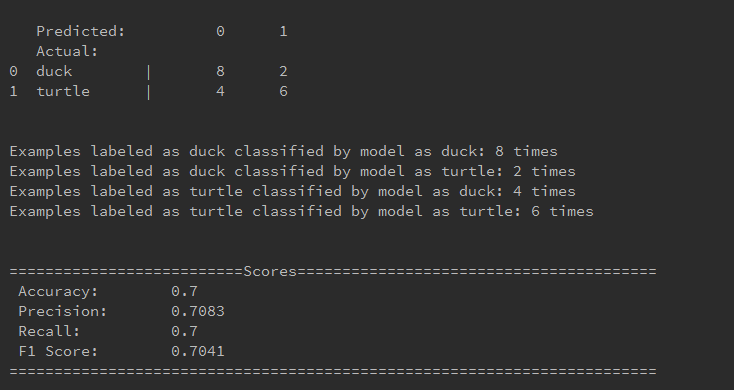

# Neruti Deep Learning Demo 2
>   by Neruti Developers

##Introduction
This repo demonstrates using deep learning algorithm to predict and classified patterns based on two major data types:

* text
* images

### Customer Behavior Prediction
This demo is related to direct marketing campaigns of a Portuguese banking instutition.

"The marketing campaigns were based on phone calls. Often, more than one contact to the same client was required, 
in order to access if the product (bank term deposit) would be (or not) subscribed.

The classification goal is to predict if the client will subscribe a term deposit (variable y)." 

On the average website, there is an abundance of information to be collected about who interacts with your product/site
and how. By leveraging all of this data, we can gain insights into customer behavior. 

Machine learning techniques can be used to determine which customers may be interested in achieving an outcome with your
business.

Predicting customer behavior can tell you which customers to reach out to, in real time, to convert them into 
tangible outcomes.

### Image Classification with Convolutional Neutral Network(CNN)
Computer ability to recognize objects has puzzled computer scientists for over 50 years.  CNN is an algorithm that recognize 
objects in images using deep learning.

This demo illustrates using CNN to classify animal images.

##background
This repo is partially based on [DL4J Github Examples](https://github.com/deeplearning4j/dl4j-examples) with our own 
additional features:

* some code are modified
* test files are rewritten
* incorporate additional dataset from [UCI Machine Learning Repository](http://archive.ics.uci.edu/ml/)
* bank customer demographic dataset are obtained from [UCI Machine Learning Repository](http://archive.ics.uci.edu/ml/machine-learning-databases/00222/)

This repo has all required modules and dependencies configured.  You may:

1. Improve accuracy
2. Preprocess the dataset
3. Change the model
4. Reduce the dataset/ Dimensionality reduction
5. Discover your own way and discuss with us in the community chat at https://gitter.im/neruti-deeplearning/demo2-discussion 
(as this is a public channel, your idea may catch an employer's attention)
6. Raise question/issues in gitter

To read more about convolutional neural network:
http://xrds.acm.org/blog/2016/06/convolutional-neural-networks-cnns-illustrated-explanation/

##Citation
> S. Moro, R. Laureano and P. Cortez. Using Data Mining for Bank Direct Marketing: An Application of the CRISP-DM Methodology. 
> In P. Novais et al. (Eds.), Proceedings of the European Simulation and Modelling Conference - ESM'2011, pp. 117-121, Guimarães, Portugal, October, 2011. EUROSIS.

## Contributor List
*Austin Goh*  - austin@neruti.com 

---
***Disclaimer*** *This repo is provided as it-is. Please visit our [community](https://gitter.im/neruti-deeplearning/demo2-discussion) to connect with people who succeeded to perform classification and their rate of classification*

Enjoy, 
*Austin (zhao yang)*
